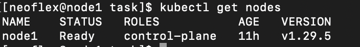
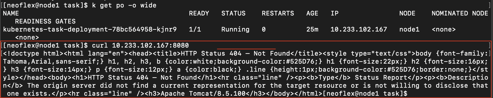
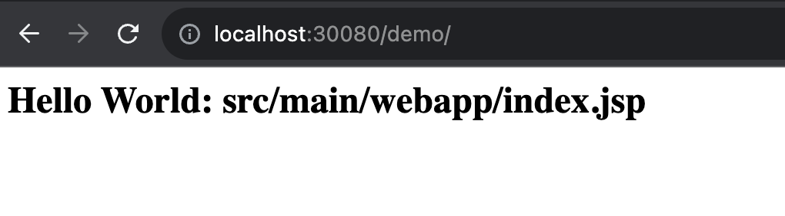
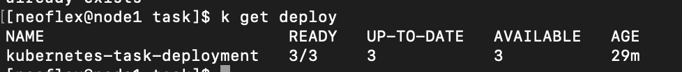
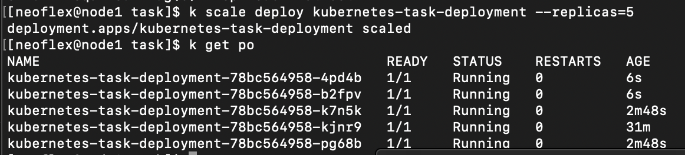
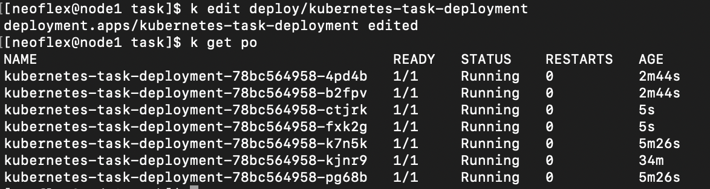
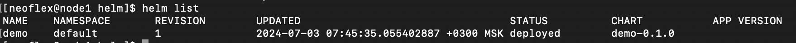
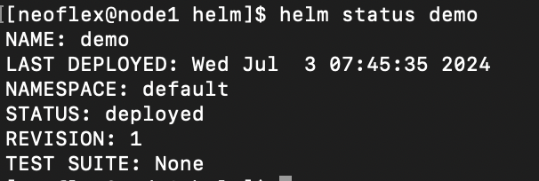

# 03 Kubernetes task

## Задание 1. Деплоим приложение

1. Скриншот вывода команды `kubectl get nodes`

2. Скриншот манифестов deployment.yaml и service.yaml.

Скрины не делал, сами манифесты лежат в папке part1

3. Скриншот выставленного через сервис типа NodePort приложения из
Вашего репозитория

4. Скриншот веб-интерфейса вашего приложения. На скриншоте должно быть
видно IP адрес и порт.

5. Скриншоты, показывающие добавление реплик приложения.

    - Увеличиваем количество реплик до 3 в манифесте deployment.yaml и применяем

    

    - Увеличиваем количество реплик до 5 при помощи `kubectl scale`

    

    - Увеличиваем количество реплик до 7 пр и помощи `kubectl edit`

    

## Задание 2. Пишем Helm чарт

1. Хелм-чарт. Можно прислать в виде ссылки на ваш репозиторий, или в виде архива, или в виде текстового документа с манифестами

Текст находится в папке `helm`

2. Скриншоты вывода команд Helm:

    • Список приложений Helm.

    

    • Описание вашего чарта через команды Helm

    

## Задание 3. Деплоим через ArgoCD

